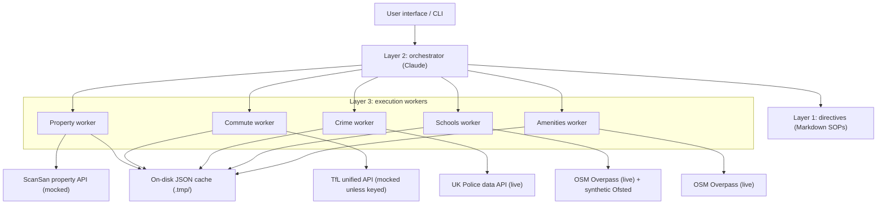

# Veo area recommender

Persona-weighted ranking of London postcode districts, built at a hackathon with
[@MasteraSnackin](https://github.com/MasteraSnackin).

The interesting piece is the architecture: **workflow logic lives in Markdown
directives read at runtime by an LLM orchestrator**, which then calls
deterministic Python workers. Changing how a persona weighs schools against
commute time means editing a Markdown file, not redeploying code, while the
scoring itself stays reproducible and inspectable rather than being left to the
model.

The design goal was a **fully auditable recommendation**: no black-box score,
every weight and contribution printed alongside the result. Live UK Police crime
and OpenStreetMap amenity data feed two of the six factors; the remaining four
run on synthetic placeholders, and the provenance table below marks which is
which for every factor.


## The question

If someone gives you a budget, a commute destination and a rough idea of what
they are optimising for, can you rank neighbourhoods for them in a way where
every part of the ranking stays visible: which factors were used, what each one
scored, and how much each one moved the result?

Most area-search tools return a ranked list and keep the weighting to
themselves. This one puts the weighting in the output.

## What it does

`demo_pipeline.py` takes a persona, a budget, a rent/buy flag and a commute
destination; shortlists candidate districts by budget; takes the first
`--max-areas` of them (default 5); enriches each with five fetchers; scores
them; and prints up to three with a per-factor breakdown. It does not score all
30 districts on a run; 30 is the covered set, not the batch size.

- **30 London postcode districts** (E, SE, SW, N, W), with fixed centroids.
- **Six scoring factors**: affordability, commute, safety, amenities, schools,
  investment quality, each normalised to 0–100.
- **Three persona weightings**, in `tools/score_areas.py`:

  | | affordability | commute | safety | amenities | schools | investment |
  |---|---|---|---|---|---|---|
  | student | 35% | 25% | 15% | 15% | 0% | 10% |
  | parent | 20% | 15% | 25% | 10% | 30% | 0% |
  | developer | 10% | 5% | 10% | 15% | 20% | 40% |

  These are hand-set defaults. They were not fitted to anything.
- **Four commute destinations**: UCL, KCL, LSE, Imperial.
- Optional natural-language explanation of each recommendation via the
  Anthropic API.

The scoring is a weighted sum, deliberately. It is auditable rather than
clever: `tools/score_areas.py` returns the factor score, the weight and the
contribution for each of the six factors, so a ranking can be taken apart.

There is no accuracy figure here, and no user study. What exists is a working
pipeline, not a measured result.

## Data provenance: read this before trusting any number

On a default run with no API keys, **two of the six scored factors come from a
live API and four are synthetic**:

| Factor | Source | Where |
|---|---|---|
| Safety | **Live** — UK Police street-level crime (`data.police.uk`), no key needed | `tools/fetch_crime_data.py` |
| Amenities | **Live** — OpenStreetMap Overpass count, no key needed | `tools/fetch_amenities.py` |
| Commute | **Synthetic by default** — haversine distance plus random noise; the real TfL API is used only if `TFL_APP_KEY` is set | `tools/fetch_tfl_commute.py` |
| Schools | **Part live, part invented** — real school locations from Overpass, then Ofsted ratings drawn at random from a weighted distribution | `tools/fetch_schools.py`, `generate_mock_school_ratings()` |
| Affordability | **Synthetic** — `random.randint` over hand-set per-district tiers | `tools/fetch_scansan.py`, `USE_MOCK_DATA = True` |
| Investment quality | **Synthetic** — same source | `tools/fetch_scansan.py` |

Setting `TFL_APP_KEY` moves commute to live and makes it three of six.

The budget shortlist is drawn from the same synthetic prices, so **which**
districts get scored is invented too, not just their affordability score.

The ScanSan property API was the intended primary source and the client is
written against it (`execution/scansan_api.py`), but no working key was
available during the build, so `USE_MOCK_DATA` is hard-coded to `True`. Any
price, growth or investment number the pipeline prints is generated, not
observed. Treat the output as a demonstration of the scoring mechanism, not as
advice about London.

Two more things a reader should know before quoting a score:

- **When a fetcher fails, the factor scores 50.** Overpass in particular is slow
  and often times out inside the 15-second budget. A factor score of exactly 50
  usually means "no data", not "average".
- **The bands are guesses.** Crime counts become a safety score through
  hand-set thresholds (`<30 → 90`, `<60 → 75`, …) that were never calibrated
  against a London-wide distribution, and the counts are not normalised by
  population or footfall.

## Architecture

Three layers: Markdown directives that specify behaviour, an LLM orchestrator
that reads them, and deterministic Python workers that fetch and score.

**Layer 2 is not code in this repository.** The orchestrator is an LLM session
reading [`directives/`](directives/) and calling the workers itself; there is no
routing loop to run. `demo_pipeline.py` is the hard-wired path through the same
workers, and it is what the CLI and the web front end actually execute.



### Data flow

1. **Request**: persona, budget, rent/buy, destination.
2. **Shortlist**: `get_candidate_areas()` keeps districts under budget with an
   affordability score of at least 60, best first, capped at 20.
3. **Enrichment**: the first `--max-areas` of the shortlist (default 5) are each
   passed through all five fetchers, sequentially.
4. **Caching**: `tools/cache_manager.py` writes each response to `.tmp/` as JSON
   with a per-source validity window (24h property, 7d commute, 30d crime, 30d
   amenities, 90d schools).
5. **Scoring**: persona weights applied to the six normalised factors.
6. **Ranking**: sort by composite score; label the top two factors scoring ≥ 70
   as strengths and anything below 50 as a weakness.
7. **Explanation**: optional Claude call per recommendation, for the top three.

Why the directives are Markdown rather than code: the scoring policy and the
per-persona weighting are the parts most likely to change, and keeping them in
prose meant they could be edited during the hackathon without a redeploy. The
directives in [`directives/`](directives/) describe what each worker actually
does, including where it invents data.

## Reproducing it

```bash
git clone https://github.com/younis-y/veo-area-recommender.git
cd veo-area-recommender
python -m venv venv
source venv/bin/activate          # venv\Scripts\activate on Windows
pip install -r requirements.txt
```

Run the pipeline. No API key is needed: the crime and amenity APIs are open, and
everything else falls back to synthetic data.

```bash
python demo_pipeline.py --persona student --budget 1200 --type rent --destination UCL --no-explanations
```

Drop `--no-explanations` to generate natural-language justifications, which
requires `ANTHROPIC_API_KEY`. Personas are `student`, `parent`, `developer`;
destinations are `UCL`, `KCL`, `LSE`, `Imperial`. `--max-areas` (default 5) sets
how many of the budget-filtered districts get enriched and scored; at most three
are printed.

Individual workers run standalone, each with a self-test in `__main__`. The
scoring engine's runs offline; the fetchers' hit the network:

```bash
python tools/score_areas.py          # offline
python tools/fetch_crime_data.py     # calls data.police.uk
python tools/fetch_amenities.py      # calls Overpass
python tools/verify_apis.py          # handshake test for the APIs named above
```

The web front end is a thin Next.js form that spawns `demo_pipeline.py` and
parses its stdout:

```bash
cd frontend
npm install
npm run dev                        # http://localhost:3000
```

## Configuration

Copy `.env.template` to `.env` and fill in only what you need. Everything is
optional; the pipeline runs with an empty `.env`. These four are the only
environment variables any code here reads.

| Variable | Needed for |
|---|---|
| `ANTHROPIC_API_KEY` | natural-language explanations |
| `TFL_APP_KEY` | real commute times instead of the distance-based placeholder |
| `SCANSAN_API_KEY` | `execution/scansan_api.py` only — the pipeline ignores it, because `USE_MOCK_DATA` is hard-coded on |
| `SCANSAN_BASE_URL` | overriding the ScanSan host |

## API and CLI reference

**POST `/api/recommendations`**

```json
{
  "persona": "student",
  "budget": 1200,
  "locationType": "rent",
  "destination": "UCL",
  "maxAreas": 5
}
```

`destination` defaults to `UCL` and `maxAreas` to `5`. The route spawns
`demo_pipeline.py`, parses its stdout and returns the top three.

**Property client** (against the real ScanSan API; needs a key):

```bash
python execution/scansan_api.py E1 SW1A N7
```

## Scope

What this repository does **not** contain, so nobody has to find out by looking:

- **No tests.** No test suite, no Jest, no Playwright, no pytest configuration
  and no test file. Two fixes in the API route (a `maxAreas` default and an
  unescaped `+` in the parser regex that had been dropping every strength) are
  therefore covered by nothing, and a regression there would be silent.
- **No CI.** Nothing runs on push.
- **No real property data.** See the provenance table above.
- **No deployment.** Caching is local JSON files in `.tmp/`. Nothing is
  containerised, hosted or autoscaled, and no cache or queue runs out of
  process.
- **No error recovery beyond retries.** `execution/scansan_api.py` sleeps for
  the `Retry-After` header on 429 and backs off exponentially on any other
  unexpected status; every other worker returns empty on failure and lets the
  scorer fall back to 50.
- **No validation layer.** The API route destructures the request body without
  checking it. The CLI validates only what `argparse` `choices` cover, so
  `--destination` accepts any string and an unrecognised one silently becomes
  central London.
- **No structured output.** The front end parses the pipeline's human-readable
  stdout with regexes, so changing a `print` statement breaks the UI silently.
- **No video pipeline in code.** The two explainer videos below were produced by
  hand with a hosted generation model; `video/output.md` is the working note.

The obvious next steps, in order of how much they would improve the output:
replace the synthetic property tier with a licensed price source, replace the
random Ofsted ratings with the Get Information About Schools feed, emit JSON
from `demo_pipeline.py` instead of parsed stdout, and add a test suite.

## Video reports

Two generated explainer videos, attached to the repository:

- https://github.com/user-attachments/assets/53a96134-f4ee-4d52-84e5-1251677074c3
- https://github.com/user-attachments/assets/7346e71d-2e66-434b-ae4a-7d3294b8ea75

## Contributors

Built at a hackathon by [@MasteraSnackin](https://github.com/MasteraSnackin) and
[@younis-y](https://github.com/younis-y), who designed the system together and
split the implementation between them under the event's time limit.

- [@MasteraSnackin](https://github.com/MasteraSnackin): the larger share of the
  code, including the data workers, the scoring engine, the orchestration
  directives and the front end.
- [@younis-y](https://github.com/younis-y): co-designed the pipeline
  architecture and the persona-weighted scoring approach, contributed to the
  implementation, and has carried the repository's documentation, provenance
  audit and maintenance since the hackathon.

## Contributing

1. Fork the repository.
2. Create a feature branch (`git checkout -b feature/name`).
3. Commit your changes.
4. Push the branch and open a pull request.

## Licence

MIT. See [LICENSE](LICENSE).
